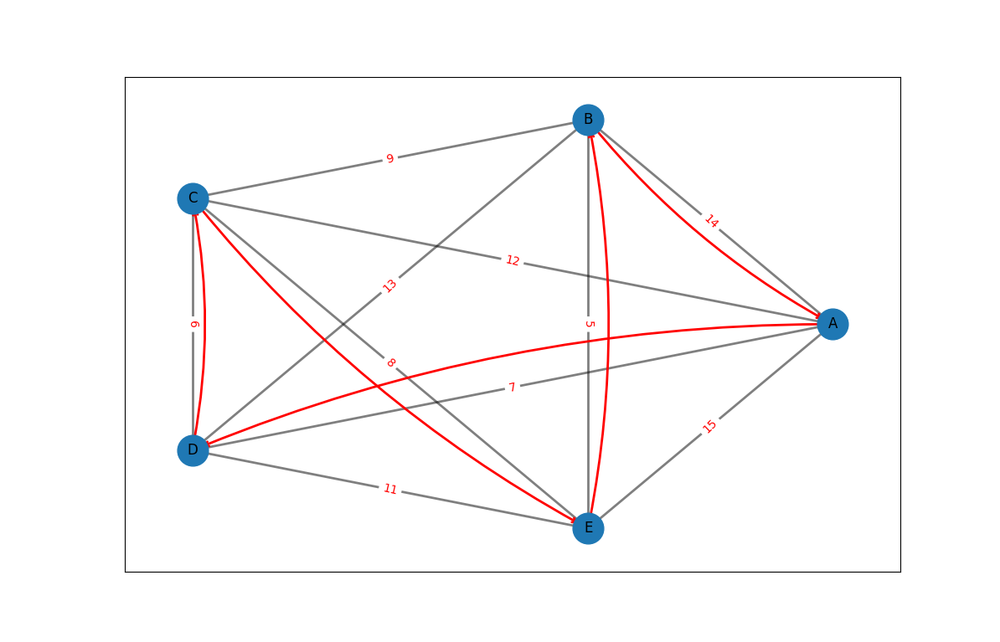

# Traveling Salesman Problem 

This project provides a simple solution to the Traveling Salesman Problem (TSP) using a nearest neighbor heuristic. The program allows users to input a starting node and computes an optimal path that visits all nodes exactly once and returns to the starting node. The result is displayed graphically using `networkx` and `matplotlib`.


## Features

- Calculates an optimal path for the TSP using a nearest neighbor heuristic.
- Plots the graph with nodes, edges, and the optimal path.
- Allows users to input a starting node interactively.


## Technologies

- **Python 3**: The programming language used.
- **NetworkX**: For creating and manipulating complex networks.
- **Matplotlib**: For plotting graphs and visualizing the optimal path.


## Code Summary

### The code consists of the following main components:

1. **`traveling_salesman(graph, start_node)`**: 
   - Implements the nearest neighbor heuristic to solve the TSP.
   - Takes a graph and a starting node as input.
   - Returns the optimal path and total weight.

2. **`plot_graph(graph, path)`**: 
   - Uses `networkx` and `matplotlib` to plot the graph.
   - Highlights the optimal path on the graph.

3. **`display_result(path, weight)`**: 
   - Prints the optimal path and total weight.

4. **`main()`**: 
   - Contains the main workflow: initializes the graph, prompts the user for input, computes the optimal path, and displays the result.


## Usage

- Clone the repository or download the script.

    ```bash
    git clone https://github.com/sinakhaksar/Travelling-salesman-problem.git
    ```

- Install the Requirements.

    ```bash
    pip install -r requirements.txt        
    ```

- Run the script using Python:

    ```bash
    python Salesman_visualization.py
    ```

- Follow the on-screen prompt to enter a starting node (choose from A, B, C, D, E).

- The program will display the optimal path and total weight, and plot the graph with the path.


## Example

```
Choose from A B C D E
Enter the starting node: a
Optimal Path: A -> D -> C -> E -> B -> A
Total Weight: 40
```




## License

MIT [License](License)

## Contributing
- Feel free to submit issues, fork the repository, and send pull requests!


Enjoy solving the Traveling Salesman Problem!

